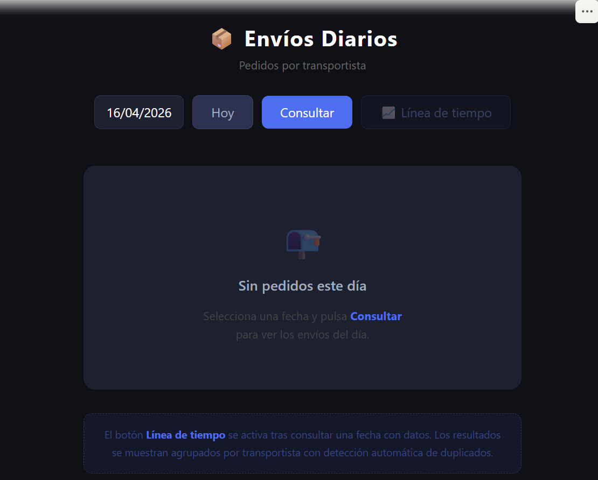
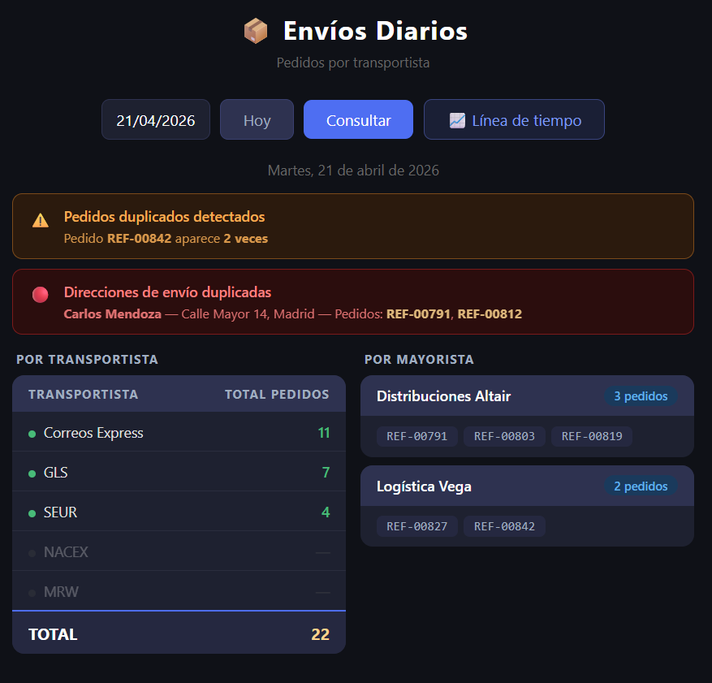
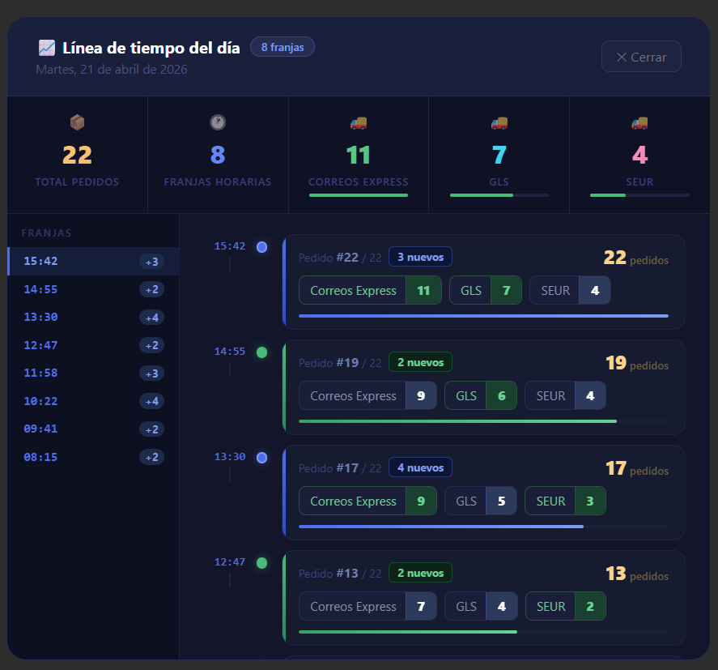

> 🌐 [English version](README.md)

# 📦 Daily Shipments Dashboard

Aplicación de escritorio para consulta y seguimiento de pedidos diarios por transportista, construida con **Python, Flask y pywebview**.

---

## ✨ Funcionalidades

- Selector de fecha con acceso rápido a "Hoy"
- Tabla de pedidos agrupados por transportista con total del día
- Detección automática de pedidos duplicados
- Detección automática de direcciones de envío duplicadas
- Línea de tiempo del día: acumulado de pedidos por hora y transportista
- Se distribuye como `.exe` mediante PyInstaller

---

## 📸 Capturas de pantalla

| Estado inicial | Dashboard con datos | Línea de tiempo |
|:-:|:-:|:-:|
|  |  |  |

---

## ⚙️ Requisitos

- Python 3.10 o superior
- SQL Server accesible en red (autenticación SQL habilitada)
- Windows (pywebview con edgechromium requiere Edge instalado)

---

## 🚀 Inicio rápido

Consulta la guía completa de configuración: [INSTALL.es.md](INSTALL.es.md)

```bash
# 1. Clona el repositorio
git clone https://github.com/tu-usuario/daily-shipments-dashboard.git
cd daily-shipments-dashboard

# 2. Crea un entorno virtual
python -m venv venv
venv\Scripts\activate

# 3. Instala las dependencias
pip install -r requirements.txt

# 4. Configura tus credenciales
copy .env.example .env
# Edita .env con tus datos de conexión

# 5. Ejecuta la app
python app.py
```

---

## 🗄️ Esquema de base de datos

La app espera tres tablas en tu SQL Server. Los nombres de tabla y campo son completamente configurables en `app.py`. Consulta [INSTALL.es.md](INSTALL.es.md) para la guía de configuración paso a paso.

### Tabla de pedidos
| Variable | Descripción | Tipo |
|---|---|---|
| `COL_PED_ID` | Clave primaria | int |
| `COL_PED_FECHA` | Fecha y hora del pedido — filtra el día y alimenta la línea de tiempo | datetime |
| `COL_PED_TRANSPORT` | FK → tabla de transportistas | int |
| `COL_PED_CLIENTE` | FK → tabla de clientes | int / varchar |
| `COL_PED_REF` | Referencia principal del pedido (detección de duplicados) | varchar |
| `COL_PED_REF2` | Referencia alternativa si `COL_PED_REF` está vacío | varchar |
| `COL_PED_CANCELADO` | `0` = activo · `1` = cancelado | bit |

### Tabla de transportistas
| Variable | Descripción | Tipo |
|---|---|---|
| `COL_TRN_ID` | Clave primaria — debe coincidir con `COL_PED_TRANSPORT` | int |
| `COL_TRN_NOMBRE` | Nombre visible del transportista | varchar |

### Tabla de clientes
| Variable | Descripción | Tipo |
|---|---|---|
| `COL_CLI_ID` | Clave primaria — debe coincidir con `COL_PED_CLIENTE` | int / varchar |
| `COL_CLI_NOMBRE` | Nombre del cliente | varchar |
| `COL_CLI_DIRECCION` | Dirección de envío (detección de duplicados de dirección) | varchar |

---

## 📁 Estructura del proyecto

```
daily-shipments-dashboard/
├── app.py                  # Servidor Flask + queries SQL
├── templates/
│   └── index.html          # Interfaz (pywebview)
├── screenshots/
│   ├── empty.png           # Captura estado inicial
│   ├── dashboard.png       # Captura dashboard con datos
│   └── timeline.png        # Captura modal línea de tiempo
├── requirements.txt        # Dependencias Python
├── .env                    # Credenciales (nunca subir a GitHub)
├── .env.example            # Plantilla de credenciales
├── .gitignore
├── README.md               # Versión en inglés
├── README.es.md            # Este archivo (español)
├── INSTALL.md              # Guía de configuración (inglés)
└── INSTALL.es.md           # Guía de configuración (español)
```

---

## 📋 Dependencias

```
Flask
pymssql
pywebview
python-dotenv
pyinstaller
```

---

## 📄 Licencia

MIT
